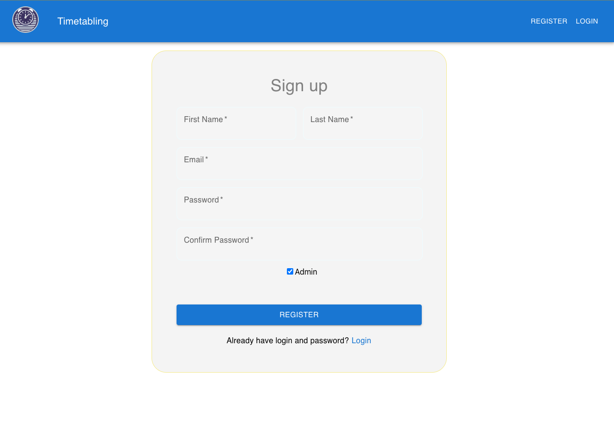

# 2023 M.Comp Timetable Application

## Overview

This full-stack timetable management system is designed to streamline the process of generating, managing, and viewing university timetables. It leverages a Genetic Algorithm (GA) for optimization and handles session allocation based on staff availability, venue capacity, and equipment type. The system is containerized using Docker and Docker Compose for easy setup and deployment, and it includes robust testing, data migration, and version control features.

## Prerequisites

Ensure you have the following installed on your system before setting up the application:

- **Docker** (for containerization)
- **Docker Compose** (for managing multi-container Docker applications)
- **Git** (for version control)
- **Node.js** (for running the Electron app and managing the front-end)

## Installation

### Clone the Repository

First, clone the repository to your local machine:

```bash
git clone git@bitbucket.org:curtincomputingprojects/2023-m-comp-timetable.git
cd 2023-m-comp-timetable
```

### Open the Workspace

Use the provided `.code-workspace` file to ensure all tasks, settings, and extensions are correctly configured:

1. **Open the Workspace**:  
   In VSCode, navigate to `File -> Open Workspace...` and select `2023-m-comp-timetable.code-workspace`.

### Building and Running the Application

Once you have cloned the repository and opened the workspace, follow these steps to build and run the application.

#### Common Docker Tasks

The project includes a set of predefined tasks in `tasks.json` to help manage the Docker containers and development environment efficiently:

1. **Rebuild and Run Docker**:  
   This task will rebuild all Docker containers and start the application:

   ```bash
   docker-compose up --build
   ```

   You can also trigger this task via VSCode by selecting **Tasks: Run Task** and choosing "Rebuild and Run Docker."

2. **Run Docker**:  
   Start Docker containers without rebuilding them:

   ```bash
   docker-compose up
   ```

3. **Stop Docker**:  
   Stop all running Docker containers:

   ```bash
   docker-compose down
   ```

4. **Clean All Docker Images**:  
   Remove all unused Docker images:

   ```bash
   docker image prune -a --force
   ```

5. **Clean All Docker Volumes**:  
   Remove all unused Docker volumes:

   ```bash
   docker volume prune -a --force
   ```

6. **Sequential Docker Tasks**:  
   Execute a series of Docker commands sequentially (stopping containers, cleaning images/volumes, and rebuilding):

   ```bash
   echo Sequential Docker Tasks Completed
   ```

   This will sequentially run the following tasks: "Stop Docker", "Clean All Docker Images", "Clean All Docker Volumes", and "Rebuild and Run Docker."

#### Running the Application

1. **Build and Run the Application**:  
   To build and run the application using Docker, run the following command:

   ```bash
   docker-compose up --build
   ```

2. **Start the Electron App**:  
   The front-end is powered by Electron. To run the Electron app, use the following command:

   ```bash
   npm run electron-dev
   ```

   This command is set up in the `tasks.json` and can also be executed by selecting **Tasks: Run Task** and choosing "Start Electron."

### Database Setup

Download the database file from the following link and ensure it is correctly configured within your Docker setup:

```plaintext
https://curtin-my.sharepoint.com/:u:/g/personal/21276219_student_curtin_edu_au/EdD90XgllmtAlL3yU-OtnMcBnx7ApsH0Cl8rT5U_kyL5lA
```

The database can be managed using phpMyAdmin:

- **phpMyAdmin**:
  - URL: `http://localhost:8080`
  - **Server**: `db`
  - **Username**: `root`
  - **Password**: `un1T1M3t4bLiNG`

## Usage

Once the application is running, you can access the following components:

- **Client Application**:  
  Visit `http://localhost:3000` to interact with the client-side UI.
- **Server**:  
  The server API is available at `http://localhost:5005`.
- **API Documentation**:  
  API documentation is available via Swagger at `http://localhost:5005/swagger`.
- **phpMyAdmin**:  
  Manage the database via `http://localhost:8080`.

## Development Workflow

### Data Migrations

The application includes tasks for handling database migrations using Flask-Migrate:

1. **Run Data Migration**:  
   Apply new database migrations:

   ```bash
   docker-compose exec server flask db upgrade <migrationVersion>
   ```

2. **Rollback Data Migration**:  
   Rollback to a previous migration:

   ```bash
   docker-compose exec server flask db downgrade <migrationVersion>
   ```

You can trigger these tasks via VSCode by selecting **Tasks: Run Task** and choosing either "Run Data Migration" or "Run Data Migration Rollback." You will be prompted to enter the desired migration version.

### Testing

Automated tests are integrated into the Docker environment:

1. **Run Tests**:  
   To run the test suite, execute the following command:

   ```bash
   docker-compose up tester
   ```

   This task is also available in VSCode as **Tasks: Run Task -> Run Test**.

### Other Tasks

- **Rebuild npm Libraries**:  
  To rebuild all npm dependencies, use the following command:

  ```bash
  npm install
  ```

  This task is defined in the `tasks.json` and can be executed by selecting **Tasks: Run Task -> Rebuild npm library**.

## Key Features and Highlights

- **Genetic Algorithm Optimization**:  
  The timetable generation process uses a Genetic Algorithm to minimize conflicts related to staff availability, venue capacity, and equipment type. The algorithm has been optimized for performance across multiple sprints.

- **UI/UX Enhancements**:  
  The user interface has been significantly improved with updated layouts, a new logo, a responsive footer, and better management of properties and sessions.

- **Timetable Import/Export**:  
  The application supports importing timetables from JSON files and exporting generated timetables for future use.

- **Customizable User Profiles**:  
  Users can update their profiles with avatars and custom descriptions.

- **Comprehensive Testing**:  
  The project includes a suite of automated unit tests covering routes, models, and core functionality to ensure consistent behavior.

---

# Showcase

Below are the key features demonstrated via screenshots:

### 1. Signup/Signin




### 2. Dashboard


### 3. Import Existing Timetable


### 4. Generate Timetable

#### 4.1 Customised Dataset


#### 4.2 Configurable Algorithm Parameters


#### 4.3 Generating In Progress


#### 4.4 Generate successfully


### 5. Timetable Management


#### 5.1 Timetable by Day


#### 5.2 Timetable by Venue


#### 5.3 Timetable by Unit


#### 5.4 Pipeline Timetable


### 6. Property Management


## License

This project is licensed under the MIT License - see the [LICENSE](LICENSE) file for details.
